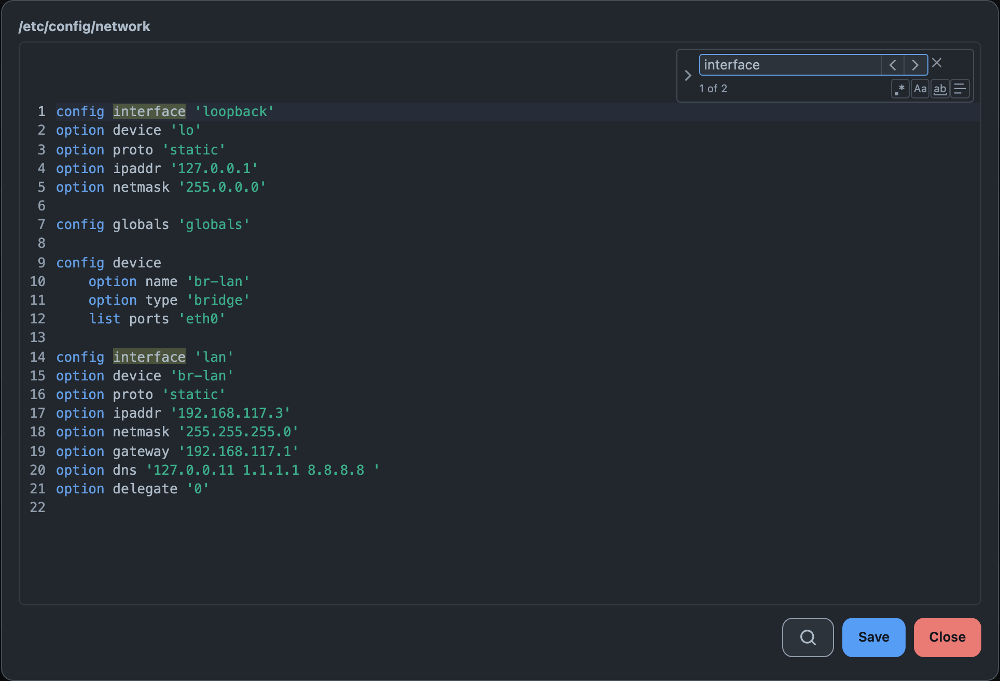

# LUCI-APP-FOOTSTRAP-FILES

**English** · [Русский](README_ru.md)

[](https://owfeed.org/install/)
[](https://owfeed.org/install/)

A file manager page for LuCI on OpenWrt 24.10 and newer: browse the router's filesystem, upload and
download, rename, copy, move, change permissions, and edit text files with syntax highlighting.
`luci-base` and `cgi-io` are the only dependencies — there is no backend of its own.

Written for the [Footstrap](https://github.com/VizzleTF/luci-theme-footstrap) theme and usable under
any other: the listing is a stock LuCI `<table class="table">`, and the stylesheet is scoped to this
package's own `.fsf-*` classes, unlayered and without one `!important`.

<picture>
  <source media="(prefers-color-scheme: dark)" srcset="assets/readme/tiles-dark.png">
  
</picture>

<details>
<summary>The editor, with find-and-replace open</summary>



</details>

## Install

The package is published to the `owfeed-packages` feed. Add the feed once — it installs the key, the
repository, and makes both survive a sysupgrade:

```sh
wget -qO- https://repo.owfeed.org/subscribe.sh | sh
```

Then install by name:

```sh
apk add luci-app-footstrap-files        # 25.12 and newer
opkg install luci-app-footstrap-files   # 24.10
```

Then **System → Files**.

Installing a feed's key tells the router to trust it for every package name, not only this one.
[owfeed.org/install](https://owfeed.org/install/) says what that means and shows the same steps by
hand.

Russian: apk installs `luci-i18n-footstrap-files-ru` by itself on a router that already has
`luci-i18n-base-ru`. opkg has no conditional form, so ask for it by name.

For a router the feed cannot serve, every [release](../../releases/latest) carries the same `.apk`
and `.ipk` with a usign signature beside each file.

## What it does

- **Browse** — breadcrumbs, sortable columns, a list view and a tile view, the path in the URL so a
  directory can be bookmarked
- **Change** — upload (button, or drag a file onto the folder it belongs in), download, rename,
  copy, move, delete, new file, new directory
- **Permissions** — mode and owner, shown as `drwxr-xr-x root:root`, edited as `644` and
  `user:group`, recursive only if the box is ticked
- **Edit** — syntax highlighting, line numbers, bracket matching, and find-and-replace behind a
  magnifier button beside Save (Ctrl/Cmd+F too, where there is a keyboard); files up to 1 MB
- **On a phone** — the listing cards up per file, and the editor is a real `<textarea>` underneath,
  so the keyboard, IME and autocorrect are the phone's own

No hex editor, no markdown preview, no column resizing — the parts of the stock
`luci-app-filemanager` this package leaves out.

## Selecting

One click opens; selecting several is a mode, because that is what a phone can drive. The model is
the iOS Files app: a tap opens, a long press opens the menu, and its **Select** turns on a mode
where every tap ticks and the toolbar becomes a count with Copy, Move, Delete and Done.

A mouse does not wait for the mode — Ctrl/Cmd+click toggles, Shift+click takes the range, and using
either turns the mode on. From the keyboard: arrows move, Shift+arrows extend, Space ticks, Enter
opens or edits, Ctrl/Cmd+A takes everything, Escape leaves.

## Permissions

This package asks for **full read and write access to the filesystem as root** — the same grant the
stock file manager takes:

```json
"file": { "/*": [ "list", "read", "write", "exec" ] }
```

That is what a file manager is, and it is worth stating plainly: anyone who can log into LuCI under
this package's ACL group can read and change any file on the router. There is no setting that
narrows it.

Operations ubus has no method for — `mkdir`, `mv`, `cp`, `chmod`, `chown` — run through `fs.exec`
with an **argument array** and `--` before the operands, never a shell string. A file called
`; reboot;` or `-rf` is an argument, not a command and not a flag. A name from the filesystem
reaches the page as text only: there is no `innerHTML` here, and CI fails the build if one appears.

## The editor

[prism-code-editor](https://github.com/jonpyt/prism-code-editor) (MIT) provides the editor and the
find-and-replace widget, and nothing else: **17 files, 28 KB on flash.** What it does not provide
any more is the colours or the grammars.

**uci has a grammar of its own** (`grammars.js`, 1 KB). It used to be highlighted as shell — the
closest thing the library shipped, and still wrong, because `config interface 'lan'` has no keywords
in bash and a config file came out as bare words with quoted strings. Prism's own INI grammar was
worse: measured on a 120-line `/etc/config/network`, it tokenised nine things. The shell grammar
beside it replaces the library's 5.7 KB `bash`, which described here-documents and process
substitution for files that contain neither.

**The colours come from the theme, not from GitHub** (`editor.css`). The library ships a light and a
dark sheet of literals and expects the page to swap them; this is one file on the 26 export-tier
names every LuCI theme publishes, so the editor follows the page into dark mode with nothing to
choose and no second stylesheet — the contract in
[the theme's app guide](https://github.com/VizzleTF/luci-theme-footstrap/blob/main/docs/luci-app-styling-guide.md).

The editor's stylesheets live inside the view's own tree, so nothing this page loads can reach the
rest of the document — the property that ruled out the alternatives.

## Building

```sh
npm ci                                     # terser and acorn, which minify the staged payload
tools/t0.sh                                # every module parses, before and after the buildbot's jsmin
FOOTSTRAP_VERSION=0.1.0 ./tools/stage.sh   # dist/root, dist/VERSION, dist/scripts, dist/i18n-*
owfeed build                               # dist/noarch/*.apk (25.12) + dist/all/*.ipk (24.10)
./luci-app-footstrap-files/update-po.sh    # rescan strings; --check is the CI gate
```

Staging minifies what ships: terser over the view's own modules and `tools/minify-css.sh` over the
stylesheets, and terser again over the vendored editor as ES modules — every module's import and
export names compared before and after, because 17 files import each other by name. The whole
payload goes from 110,255 bytes to 68,534. Nothing in the checkout is rewritten.

An OpenWrt SDK build works too — the `Makefile` is an ordinary `luci.mk` package, and there jsmin
does the minifying because a buildbot has no node — but nothing released here comes from one: this
package is noarch, and the SDK spends five minutes per format fetching a cross toolchain in order to
run `cp`.

## Licence

Apache-2.0. The vendored editor is MIT and its licence travels with it, under
`htdocs/luci-static/resources/view/footstrap-files/vendor/pce/LICENSE`.
